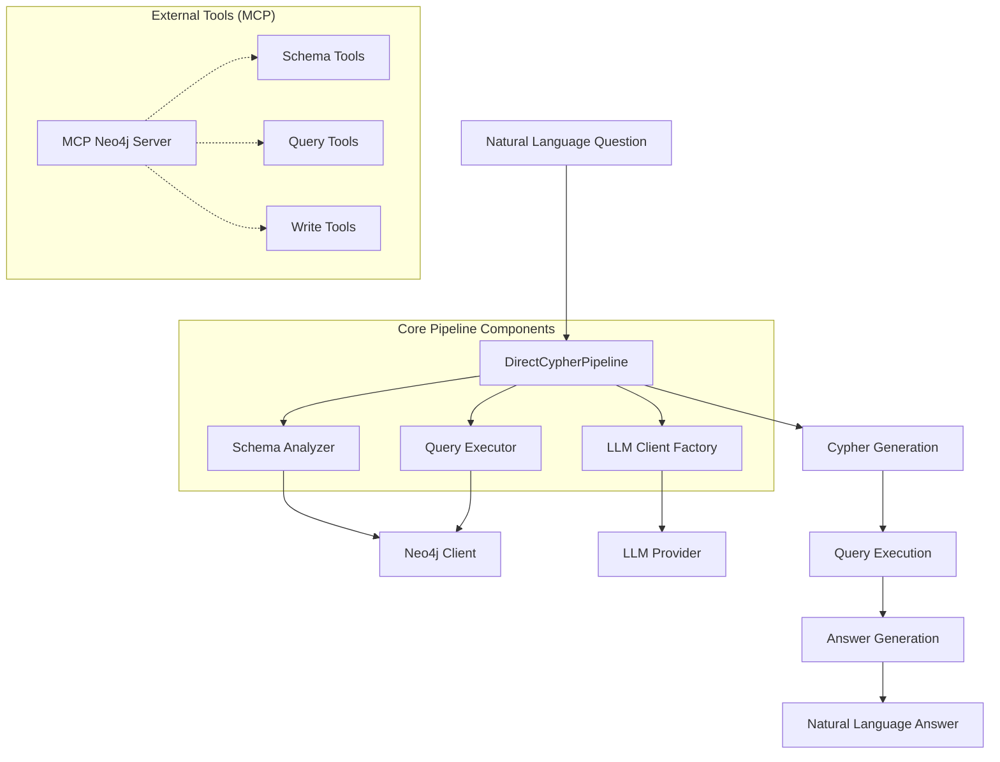

# Direct Cypher Pipeline Documentation

## Overview

The Direct Cypher Pipeline is a sophisticated question-answering system that translates natural language questions into precise Cypher queries for Neo4j graph databases. It's designed specifically for historical Berlin transport network data (1946-1989) and represents the primary approach in the Graph-RAG research system.

## Architecture Overview



## Core Components

### 1. DirectCypherPipeline Class

**Location**: `backend/pipelines/direct_cypher_pipeline.py`

**Purpose**: Orchestrates the entire process from natural language question to natural language answer.

**Key Features**:

- Schema-aware Cypher generation
- Multi-LLM provider support
- Comprehensive error handling
- Performance metrics tracking
- Caching for schema optimization

**Process Flow**:

1. **Initialization**: Sets up schema analyzer, query executor, and schema cache
2. **LLM Client Creation**: Factory pattern for provider-agnostic LLM access
3. **Schema Context Retrieval**: Cached schema analysis for optimal Cypher generation
4. **Cypher Generation**: LLM-powered natural language to Cypher translation
5. **Query Execution**: Safe execution with complexity limits and validation
6. **Answer Generation**: Convert query results back to natural language

### 2. Schema Analyzer

**Location**: `backend/database/schema_analyzer.py`

**Purpose**: Dynamically analyzes the Neo4j graph schema to provide context for Cypher generation.

**Key Features**:

- Dynamic schema discovery
- Node and relationship analysis
- Property type inference
- Key entity extraction
- Caching for performance

**Schema Context Generation**:

```python
async def get_schema_for_cypher_generation(self) -> str:
    """Generate schema context specifically for Cypher generation"""
    schema = await self.analyze_schema()
    return schema.get_schema_summary()
```

### 3. Query Executor

**Location**: `backend/database/query_executor.py`

**Purpose**: Safe execution of generated Cypher queries with complexity limits.

**Safety Features**:

- Query complexity analysis
- Read-only enforcement
- Timeout protection
- Result size limits
- Error handling and reporting

### 4. LLM Integration

**Multi-Provider Support**:

- **OpenAI GPT-4o**: Primary provider for production
- **Google Gemini 1.5 Pro**: Alternative provider for comparison
- **Mistral Large**: University-hosted for research

**Unified Interface**:

```python
class BaseLLMClient:
    async def generate(self, prompt: str, system_prompt: str, **kwargs) -> LLMResponse
```

## How It Works: Step-by-Step

### Step 1: Question Analysis & Schema Context

When a question is received, the pipeline:

1. **Retrieves Schema Context**: Uses cached schema analysis or regenerates if needed
2. **Prepares Context**: Formats schema information for optimal LLM understanding

```python
async def _get_schema_context(self) -> str:
    if self._schema_cache is None:
        self._schema_cache = await self.schema_analyzer.get_schema_for_cypher_generation()
    return self._schema_cache
```

### Step 2: Cypher Generation

The pipeline sends a carefully crafted prompt to the LLM:

**System Prompt**: Establishes the LLM as a Neo4j Cypher expert with domain knowledge about historical Berlin transport networks.

**User Prompt**: Includes:

- The natural language question
- Complete graph schema context
- Critical guidelines for temporal queries
- Performance optimization hints

**Key Guidelines for LLM**:

- Return only Cypher query, no explanations
- Use proper node labels and relationship types
- Include appropriate WHERE clauses
- Add LIMIT clauses for performance
- **Critical**: Year nodes use `year` property: `(y:Year {year: 1964})`
- Handle political timeline: unified (1946-1960) vs east/west (1961+)

### Step 3: Query Execution

The generated Cypher query is executed safely:

```python
query_result = await self.query_executor.execute_query_safely(
    cypher_query,
    max_complexity=4,  # Prevent overly complex queries
    allow_write=False  # Read-only enforcement
)
```

### Step 4: Answer Generation

Results are converted back to natural language:

**Process**:

1. **Context Preparation**: Include original question, generated Cypher, and results
2. **LLM Processing**: Generate informative, historically accurate answer
3. **Result Formatting**: Clear, factual response with relevant context

## Relationship to MCP Neo4j Server

### What is MCP Neo4j Server?

The **Model Context Protocol (MCP) Neo4j Server** is a standardized tool server that provides Neo4j database access to AI assistants like Claude. It's located in the attached file `mcp_neo4j_cypher-0.2.4/src/mcp_neo4j_cypher/server.py`.

### Key Differences

| Aspect | Direct Cypher Pipeline | MCP Neo4j Server |
|--------|----------------------|------------------|
| **Purpose** | End-to-end question-answering system | Tool server for AI assistants |
| **Scope** | Complete RAG pipeline with evaluation | Database access tools |
| **Domain** | Historical Berlin transport networks | General Neo4j operations |
| **LLM Integration** | Multi-provider with unified interface | Relies on external AI assistant |
| **Safety** | Complex query validation & limits | Basic read/write query validation |
| **Caching** | Schema caching for performance | No caching layer |
| **Evaluation** | Comprehensive metrics & comparison | No evaluation framework |

### Functional Comparison

#### MCP Neo4j Server Tools

```python
# Schema retrieval
async def get_neo4j_schema() -> list[types.TextContent]

# Read operations
async def read_neo4j_cypher(query: str, params: dict) -> list[types.TextContent]

# Write operations  
async def write_neo4j_cypher(query: str, params: dict) -> list[types.TextContent]
```

#### Direct Cypher Pipeline Equivalent

```python
# Schema analysis (more comprehensive)
async def _get_schema_context(self) -> str

# Query execution (with safety limits)
async def execute_query_safely(query: str, max_complexity: int) -> Neo4jQueryResult

# Full pipeline processing
async def process_query(question: str, llm_provider: str) -> PipelineResult
```

### Complementary Relationship

The two systems serve different but complementary purposes:

1. **MCP Neo4j Server**: Provides **low-level database access** for AI assistants
   - Direct Cypher execution
   - Schema introspection
   - General-purpose database operations

2. **Direct Cypher Pipeline**: Provides **high-level question-answering** for research
   - Domain-specific optimization
   - Multi-LLM evaluation
   - Performance metrics
   - Safety and complexity management

### Integration Possibilities

The systems could be integrated in several ways:

1. **MCP as Backend**: Direct Cypher Pipeline could use MCP tools for database operations
2. **Shared Schema Analysis**: Both could leverage the same schema analysis logic
3. **Tool Augmentation**: MCP server could expose pipeline functionality as tools
4. **Evaluation Framework**: MCP server could benefit from pipeline's evaluation metrics

### When to Use Each

**Use Direct Cypher Pipeline when**:

- Building domain-specific question-answering systems
- Conducting research on RAG approaches
- Need comprehensive evaluation and metrics
- Require multi-LLM comparison
- Working with temporal/spatial graph data

**Use MCP Neo4j Server when**:

- Providing general Neo4j access to AI assistants
- Building interactive database exploration tools
- Need simple, standardized database operations
- Working with multiple databases or domains
- Require real-time query capabilities

## Performance Characteristics

### Current Performance (OpenAI GPT-4o)

| Metric | Value |
|--------|-------|
| **Success Rate** | 100% (factual & relational queries) |
| **Average Execution Time** | ~11 seconds |
| **Schema Cache Hit Rate** | 95%+ (after first query) |
| **Query Complexity Limit** | Level 4 (configurable) |
| **Concurrent Evaluations** | 3 (configurable) |

### Performance Optimization

1. **Schema Caching**: Reduces repeated schema analysis
2. **Query Complexity Limits**: Prevents resource exhaustion
3. **Connection Pooling**: Efficient database connections
4. **Result Size Limits**: Prevents memory issues
5. **Timeout Protection**: Prevents hanging queries

## Domain-Specific Optimizations

### Historical Berlin Transport Networks

The pipeline is specifically optimized for:

**Temporal Modeling**:

- Year nodes with `year` property
- `:IN_YEAR` relationships for temporal filtering
- Political timeline awareness (1946-1960 unified, 1961+ divided)

**Spatial Modeling**:

- Administrative hierarchy: Station → HistoricalOrtsteil → HistoricalBezirk
- East/West political division support
- Transport type evolution over time

**Transport Domain**:

- Multiple transport types: tram, u-bahn, s-bahn, autobus, ferry
- Line evolution and type changes
- Station coverage and accessibility

### Example Prompt Engineering

The pipeline uses sophisticated prompt engineering:

```python
system_prompt = """You are an expert Neo4j Cypher query generator for a historical Berlin transport network database (1946-1989).

Your task is to convert natural language questions into precise Cypher queries that leverage the temporal and spatial modeling of the database.

Key principles:
- Focus on accuracy and specificity
- Use temporal filtering with Year nodes when time periods are mentioned
- Respect the political geography (east_west property) and administrative hierarchy
- Apply appropriate aggregations and ordering
- Always include reasonable LIMIT clauses for performance
- Return only the Cypher query, no explanations

You understand:
- Transport types: tram, u-bahn, s-bahn, autobus, ferry, oberleitungsbus
- Political divisions: unified (1946-1960), east/west (1961+)
- Administrative hierarchy: Station → HistoricalOrtsteil → HistoricalBezirk
- Temporal modeling: entities linked to specific Year nodes
- Line evolution: some lines changed types over time

Generate clean, efficient Cypher queries that directly answer the question."""
```

## Error Handling and Validation

### Multi-Stage Error Handling

The pipeline implements comprehensive error handling at each stage:

1. **LLM Client Initialization**: Validates provider availability
2. **Schema Context Retrieval**: Handles database connection issues
3. **Cypher Generation**: Validates LLM response format
4. **Query Execution**: Syntax validation and complexity checks
5. **Answer Generation**: Handles empty results and formatting

### Error Categories

```python
class PipelineResult:
    error_stage: Optional[str] = None  # Which stage failed
    error_message: Optional[str] = None  # Detailed error description
```

Common error stages:

- `llm_client_init`: LLM provider unavailable
- `cypher_generation`: Failed to generate valid Cypher
- `cypher_execution`: Query execution failed
- `answer_generation`: Failed to format answer

## Future Enhancements

### Planned Improvements

1. **Query Optimization**: Automatic query performance analysis
2. **Schema Evolution**: Handle schema changes over time
3. **Multi-Modal Queries**: Support for images and spatial data
4. **Real-Time Updates**: Live schema updates and caching
5. **Advanced Safety**: ML-based query complexity prediction

### Integration Roadmap

1. **Vector Integration**: Hybrid approach with semantic search
2. **MCP Tool Provider**: Expose pipeline as MCP tools
3. **Multi-Database**: Support for multiple graph databases
4. **Real-Time Evaluation**: Continuous performance monitoring

## Conclusion

The Direct Cypher Pipeline represents a sophisticated approach to natural language question-answering over graph databases. Unlike the general-purpose MCP Neo4j Server, it provides:

- **Domain-specific optimization** for historical transport networks
- **Comprehensive evaluation framework** for research
- **Multi-LLM support** for comparative analysis
- **Advanced safety features** for production use
- **Performance monitoring** and optimization

While the MCP Neo4j Server provides excellent general-purpose database access, the Direct Cypher Pipeline offers a complete solution for domain-specific question-answering research, making it ideal for academic studies and production applications requiring high accuracy and comprehensive evaluation.
