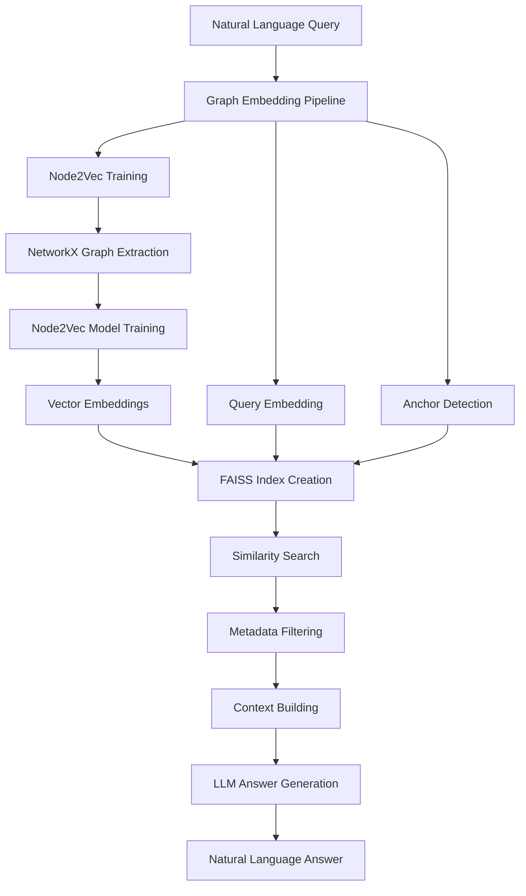

# Graph Embedding Pipeline Documentation

## Overview

The **Graph Embedding Pipeline** implements topological similarity retrieval using Node2Vec embeddings and FAISS vector search. Instead of walking the graph symbolically, it embeds structural patterns into vectors and searches for topologically similar entities.

## Core Concept

The pipeline uses **structural embeddings** to find entities that function similarly within the transport network, even when they may not be directly connected or semantically related.

### Key Components

1. **Node2Vec Embeddings**: Captures structural roles and connection patterns
2. **FAISS Vector Index**: Enables fast approximate nearest neighbor search
3. **Hybrid Search**: Combines semantic and structural similarity
4. **Temporal Filtering**: Supports year-specific network snapshots

## How It Works

### Architecture Flow



### Step-by-Step Process

#### 1. Graph Preprocessing

- Extracts NetworkX graph from Neo4j
- Includes stations, lines, and administrative areas
- Applies temporal filtering if specified
- Calculates edge weights based on relationship types

#### 2. Node2Vec Training

- Generates random walks on the graph structure
- Learns vector representations for each node
- Captures both local and global structural patterns
- Caches trained embeddings for reuse

#### 3. Vector Indexing

- Creates FAISS index for fast similarity search
- Normalizes vectors for cosine similarity
- Maps between graph nodes and vector indices
- Supports multiple index types (flat, IVF, HNSW)

#### 4. Query Processing

- Embeds natural language query using sentence transformers
- Detects anchor nodes mentioned in the question
- Performs hybrid search combining semantic and structural similarity
- Applies metadata filters based on question content

#### 5. Context Retrieval

- Retrieves top-k structurally similar nodes
- Builds context from node attributes and relationships
- Includes similarity scores and topological explanations

#### 6. Answer Generation

- Uses LLM to interpret similarity results
- Explains structural relationships and patterns
- Connects findings back to the original question

## Configuration Options

### Embedding Parameters

```python
EmbeddingTrainingConfig(
    dimensions=128,           # Embedding vector size
    walk_length=80,          # Length of random walks
    num_walks=10,            # Number of walks per node
    p=1.0,                   # Return parameter (BFS/DFS bias)
    q=1.0,                   # In-out parameter (local/global bias)
    neighborhood_hops=2,     # Hops for neighborhood fingerprints
    max_neighbors=50         # Max neighbors in fingerprint
)
```

### Search Parameters

- **max_results**: Number of similar nodes to return (default: 10)
- **semantic_weight**: Weight for semantic similarity (default: 0.6)
- **structural_weight**: Weight for structural similarity (default: 0.4)
- **re_rank**: Enable hybrid search with anchors (default: True)

### Temporal Parameters

- **year_filter**: Filter to specific year (e.g., 1970)
- **include_administrative**: Include administrative areas (default: True)

## Use Cases

### 1. Structural Hub Discovery

**Query**: "Which stations function like Zoologischer Garten in terms of connectivity?"

**How it works**:

- Identifies Zoologischer Garten as a major interchange hub
- Finds stations with similar connection patterns
- Returns structurally equivalent hubs (e.g., Ernst-Reuter-Platz, Ostbahnhof)

### 2. Line Similarity Analysis

**Query**: "What lines are similar to U6 in terms of network structure?"

**How it works**:

- Analyzes U6's structural role in the network
- Finds lines with similar connectivity patterns
- Considers route length, station types, and network position

### 3. Temporal Structural Changes

**Query**: "Find stations similar to Alexanderplatz in 1970"

**How it works**:

- Filters network to 1970 snapshot
- Embeds historical network structure
- Finds stations with similar roles in that time period

### 4. Administrative Area Patterns

**Query**: "Which districts have similar transport connectivity patterns?"

**How it works**:

- Includes administrative areas in embeddings
- Compares connection density and transport types
- Identifies districts with similar accessibility patterns

## Implementation Details

### Graph Extraction

The pipeline extracts different node types:

```python
# Core transport entities
node_types = [
    "Station", "CoreStation",      # Individual stops
    "Line", "CoreLine",            # Transit routes
    "HistoricalOrtsteil",          # Neighborhoods
    "HistoricalBezirk",            # Districts
]

# Relationship types with weights
relationships = {
    'SERVES': 1.0,           # Line serves station
    'CONNECTS_TO': 1.2,      # Direct connections
    'LOCATED_IN': 1.5,       # Geographic containment
    'PART_OF': 2.0,          # Administrative hierarchy
}
```

### Embedding Training

Node2Vec parameters for Berlin transport network:

- **p=1.0, q=1.0**: Balanced exploration (neither BFS nor DFS biased)
- **walk_length=80**: Captures medium-range structural patterns
- **dimensions=128**: Good balance of expressiveness and efficiency

### Vector Search

FAISS index types:

- **IndexFlatIP**: Exact search, best for smaller graphs (<10k nodes)
- **IndexIVFFlat**: Approximate search with clustering
- **IndexHNSWFlat**: Hierarchical search for large graphs

### Hybrid Scoring

Combines semantic and structural similarity:

```python
combined_score = (
    semantic_weight * semantic_similarity + 
    structural_weight * structural_similarity
)
```

## Performance Characteristics

### Training Time

- **Small graph** (1k nodes): ~30 seconds
- **Medium graph** (5k nodes): ~2 minutes
- **Large graph** (20k nodes): ~10 minutes

### Query Time

- **Vector search**: <50ms for 10k nodes
- **Context building**: ~100ms
- **LLM generation**: 2-5 seconds
- **Total**: ~3-6 seconds per query

### Memory Usage

- **Embeddings**: ~5MB per 1k nodes (128 dimensions)
- **FAISS index**: ~2x embedding size
- **Graph cache**: ~10MB per 1k nodes

## Advantages

### Why Graph Embeddings Excel

1. **Fuzzy Similarity**: Works when no direct path exists between entities
2. **Scalability**: ANN indexes handle millions of nodes efficiently
3. **Structural Understanding**: Captures topological roles better than text
4. **Temporal Robustness**: Embeddings work across different time periods

### Compared to Other Approaches

| Approach | Transparency | Scalability | Flexibility | Training Cost |
|----------|-------------|-------------|-------------|---------------|
| Direct Cypher | High | Medium | Low | None |
| Path Traversal | High | Low | Medium | None |
| Vector RAG | Low | High | Medium | Medium |
| **Graph Embedding** | **Medium** | **High** | **High** | **High** |

## Limitations

### Trade-offs

1. **Training Required**: Must pre-compute embeddings when graph changes
2. **Less Transparent**: Vector distances not human-readable
3. **Parameter Sensitive**: Node2Vec parameters affect quality
4. **Memory Intensive**: Requires caching embeddings and indices

### When Not to Use

- **Simple factual queries**: Direct Cypher is more efficient
- **Exact relationship queries**: Path traversal is more precise
- **Small datasets**: Overhead may not be worth it
- **Frequently changing graphs**: Re-training cost is high

## API Usage

### Basic Usage

```python
from backend.pipelines.graph_embedding_pipeline import GraphEmbeddingPipeline

pipeline = GraphEmbeddingPipeline()

result = await pipeline.process_query(
    "Which stations are structurally similar to Alexanderplatz?",
    llm_provider="mistral",
    max_results=10,
    year_filter=1970
)
```

### Advanced Configuration

```python
result = await pipeline.process_query(
    question="Find hub stations like Zoologischer Garten",
    llm_provider="openai", 
    max_results=15,
    semantic_weight=0.7,
    structural_weight=0.3,
    re_rank=True
)
```

### Pre-warming

```python
# Pre-compute embeddings for faster queries
await pipeline.warm_up(year_filter=1970)
```

## Integration with Frontend

The pipeline is available through the standard API:

```javascript
const response = await fetch('/api/query', {
    method: 'POST',
    headers: { 'Content-Type': 'application/json' },
    body: JSON.stringify({
        question: "Find stations similar to Alexanderplatz",
        pipeline_names: ["graph_embedding"],
        llm_providers: ["mistral"]
    })
});
```

## Testing

Run the test suite:

```bash
python test_graph_embedding_pipeline.py
```

Test individual components:

```python
# Test graph preprocessing
from backend.pipelines.graph_preprocessing import get_graph_preprocessing_service

# Test embedding training  
from backend.pipelines.node_embedding_service import get_node_embedding_service

# Test vector indexing
from backend.pipelines.graph_vector_index import get_graph_vector_index_service
```

## Troubleshooting

### Common Issues

1. **Memory errors during training**:
   - Reduce graph size with `max_nodes` parameter
   - Lower embedding dimensions
   - Use fewer random walks

2. **Slow query performance**:
   - Pre-warm embeddings with `warm_up()`
   - Use faster FAISS index (HNSW)
   - Reduce `max_results`

3. **Poor similarity results**:
   - Adjust Node2Vec parameters (p, q)
   - Include more relationship types
   - Try different semantic/structural weights

4. **Import errors**:

   ```bash
   pip install node2vec torch torch-geometric sentence-transformers faiss-cpu
   ```

### Debug Mode

Enable detailed logging:

```python
import logging
logging.basicConfig(level=logging.DEBUG)
```

## Future Enhancements

### Planned Features

1. **Dynamic embeddings**: Update embeddings incrementally
2. **Multi-scale embeddings**: Different resolutions for different queries
3. **Attention mechanisms**: Learn query-specific embedding weights
4. **Knowledge graph embeddings**: Use TransE/RotatE for semantic relationships

### Research Directions

1. **Temporal embeddings**: Capture how structure changes over time
2. **Multi-modal embeddings**: Combine structure with geographic features
3. **Explainable embeddings**: Make similarity more interpretable
4. **Active learning**: Improve embeddings based on query feedback

---

*Last updated: July 2025*
